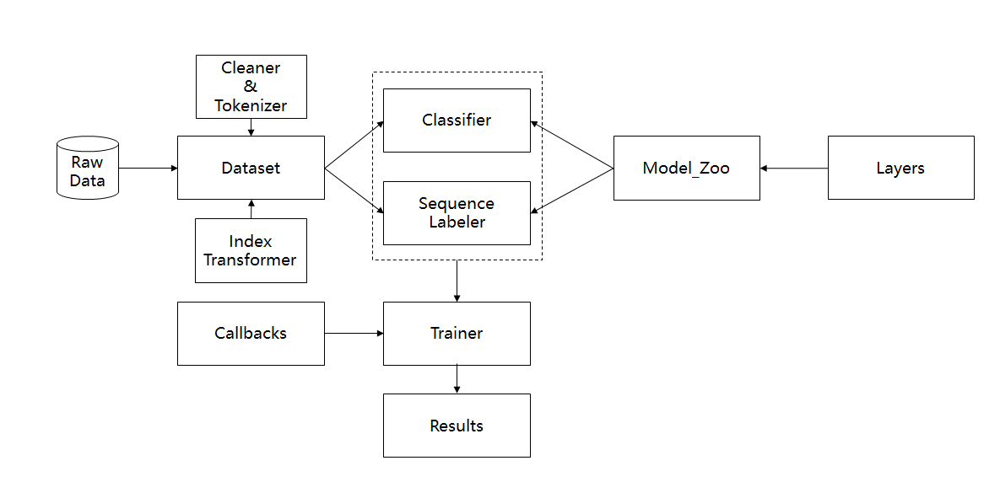

# nlp_toolkit

中文NLP基础工具箱，包括以下任务：例如文本分类、序列标注等。

本仓库复现了一些近几年比较火的nlp论文。所有的代码是基于keras开发的。

不到10行代码，你就可以快速训练一个文本分类模型（暂时不支持多标签任务）或序列标注模型，或者可以体验基于名词短语切分的分词器

## 直接安装

```bash
pip install nlp_toolkit

# 使用GPU
pip install tensorflow-gpu, GPUtil
```

## 手动安装

```bash
git clone https://github.com/stevewyl/nlp_toolkit
cd nlp_toolkit

# 只使用CPU
pip install -r requirements.txt

# 使用GPU
pip install -r requirements-gpu.txt

# 如果keras_contrib安装失败
pip install git+https://www.github.com/keras-team/keras-contrib.git
```

### 安装错误

1. ImportError: cannot import name 'normalize_data_format'

    ```bash
    pip install -U keras
    ```

## 使用方法

本仓库的框架图：



主要由以下几大模块组成：

1. Dataset：处理文本和标签数据为适合模型输入的格式，主要进行的处理操作有清理、分词、index化

2. Model Zoo & Layer：近几年在该任务中常用的模型汇总及一些Keras的自定义层

   目前支持的自定义层有如下：

   * 1D注意力层 🆗
   * 2D注意力层 🆗
   * 多头注意力层 🆗
   * 位置嵌入层 🆗
   * K-max池化层

3. Trainer：定义模型的训练流程，支持bucket序列、自定义callbacks和N折交叉验证

    * bucket序列：通过将相似长度的文本放入同一batch来减小padding的多余计算来实现模型训练的加速，在文本分类任务中，能够对RNN网络提速2倍以上（**暂时不支持含有Flatten层的网络**）
  
    * callbacks：通过自定义回调器来控制训练流程，目前预设的回调器有提前终止训练，学习率自动变化，更丰富的评估函数等

    * N折交叉验证：支持交叉验证来考验模型的真实能力

4. Classifier & Sequence Labeler：封装类，支持不同的训练任务

5. Application：目前工具箱内封装了基于jieba的名词短语分词器 Chunk_Segmentor (如需模型文件，可以邮件联系我)

简单的用法如下：

```python
from nlp_toolkit import Dataset, Classifier, Labeler
import yaml

config = yaml.load(open('your_config.yaml'))

# 分类任务
dataset = Dataset(fname='your_data.txt', task_type='classification', mode='train', config=config)
text_classifier = Classifier('multi_head_self_att', dataset)
trained_model = text_classifier.train()

# 序列标注任务
dataset = Dataset(fname='your_data.txt', task_type='sequence_labeling', mode='train', config=config)
seq_labeler = Labeler('word_rnn', dataset)
trained_model = seq_labeler.train()

# 预测（以文本分类为例）
dataset = Dataset(fname='your_data.txt', task_type='classification', mode='predict', tran_fname='your_transformer.h5')
text_classifier = Classifier('bi_lstm_att', dataset)
text_classifier.load(weight_fname='your_model_weights.h5', para_fname='your_model_parameters.json')
y_pred = text_classifier.predict(dataset.texts)

# chunk分词
# 第一次import的时候，会自动下载模型和字典数据
# 支持单句和多句文本的输入格式，建议以列表的形式传入分词器
# 源代码中已略去相关数据的下载路径，有需要的请邮件联系
from nlp_toolkit.chunk_segmentor import Chunk_Segmentor
cutter = Chunk_Segmentor()
s = '这是一个能够输出名词短语的分词器，欢迎试用！'
res = [item for item in cutter.cut([s] * 10000)] # 1080ti上耗时8s
# 提供两个版本，accurate为精确版，fast为快速版但召回会降低一些，默认精确版
cutter = Chunk_Segmentor(mode='accurate')
cutter = Chunk_Segmentor(mode='fast')
# 是否输出词性， 默认开启
cutter.cut(s, pos=False)
# 是否将可切分的名词短语切分，默认关闭
cutter.cut(s, cut_all=True)
# 输出格式（词列表，词性列表，名词短语集合）
[
    (
        ['这', '是', '一个', '能够', '输出', '名词_短语', '的', '分词器', ',', '欢迎', '试用', '!'],
        ['r', 'v', 'mq', 'v', 'vn', 'np', 'ude1', 'np', 'w', 'v', 'v', 'w'],
        ['分词器', '名词_短语']
    )
    ...
]
```

更多使用细节，请阅读[**examples**](https://github.com/stevewyl/nlp_toolkit/tree/master/examples)文件夹中的Jupyter Notebook和chunk_segmentor页面的[**README**](https://github.com/stevewyl/nlp_toolkit/tree/master/nlp_toolkit/chunk_segmentor)

### 数据格式

1. 文本分类：每一行预先分好词的文件，每一行的格式如下：

    __label__标签1 __label__标签2 ... 词 词 ... 词\n

    例如 “__label__neg 公司 目前 地理 位置 不 太 理想 ， 离 城市 中心 较 远点 。”

2. 序列标注：每一行预先分好词的文件，支持两种数据格式，每一行的格式如下：

    词###标签 [TAB] 词###标签 [TAB] ... \n

    例如 “目前###O\t公司###O\t地理###B-Chunk\t位置###E-Chunk\t不###O\t太###O\t理想\n”

    或者 CONLL的标准格式

    词 [TAB] 标签

    词 [TAB] 标签

    ...

    词 [TAB] 标签

    词 [TAB] 标签

    ...

    例如：

    目前\tO

    公司\tO

    ...

    地理\tB-Chunk

    位置\tE-Chunk

    不\tO

    太\tO

    理想\tO

    标签含义（这里以chunk为例）：

    * O：普通词
    * B-Chunk：表示chunk词的开始
    * I-Chunk：表示chunk词的中间
    * E-Chunk：表示chunk词的结束

    建议：文本序列以短句为主，针对标注实体的任务，最好保证每行数据中有实体词（即非全O的序列）

    你可以通过以下方式互相转换两种数据格式：
    ```python
    from nlp_toolkit.utilities import convert_seq_format
    # here we convert dataset from conll format to basic format
    convert_seq_format(input_file, output_file, 'basic')
    ```

    ps: 具体可查看data文件夹中对应的[**示例数据**](https://github.com/stevewyl/nlp_toolkit/tree/master/sample_data)

3. 预测：不同任务每一行均为预先分好词的文本序列

4. 支持简单的自己添加数据的方法

   ```python
   dataset = Dataset(task_type='classification', mode='train', config=config)
   # classification
   dataset.add({'text': '我 爱 机器 学习', 'label': 'pos'})
   # sequence labeling
   dataset.add({'text': '我 爱 机器 学习', 'label': 'O O B-Chunk E-Chunk'})
   # after you add all your data
   dataset.fit()
   ```

### 配置文件

nlp_toolkit通过配置文件来初始化训练任务

train: 表示训练过程中的参数，包括batch大小，epoch数量，训练模式等

data: 表示数据预处理的参数，包括最大词数和字符数，是否使用词内部字符序列等

embed: 词向量，pre表示是否使用预训练词向量

剩下的模块对应不同的模型的超参数

具体细节可查看仓库根目录下的两个**配置文件**注释

### 可视化

1. attention权重可视化

    ```python
    # only support model bi_lstm_att currently
    # first you need to get attention_weights from model predictions
    # you can find the actual usage in examples/sentiment.ipynb
    texts = '有 能力 的 人 就 有 很多 机会'
    from nlp_toolkit import visualization as vs
    vs.mk_html(texts, attention_weights)
    ```

    <span style="background-color: #FFFAFA">有</span> <span style="background-color: #FFB6B6">能力</span> <span style="background-color: #FFFBFB">的</span> <span style="background-color: #FFF8F8">人</span> <span style="background-color: #FFEFEF">就</span> <span style="background-color: #FFE3E3">有</span> <span style="background-color: #FFEFEF">很多</span> <span style="background-color: #FF9191">机会</span>

2. 实体预测结果可视化

   ```python
   from nlp_toolkit import visualization as vs
   vs.entity_visualization(dataset.texts, y_pred, output_fname='result.html')
   ```

3. acc/loss 曲线可视化

   ```python
   # after your have trained one model, you will also get a history object, which contains some loss and metrics info
   from nlp_toolkit import visualization as vs
   vs.plot_loss_acc(history, task='sequence_labeling')
   ```

### 其他

1. 生成词向量小文件

    ```python
    from nlp_toolkit.utilities import gen_small_embedding
    gen_small_embedding(vocab_file, embed_file, output_file)
    ```

## 模型

### 文本分类

1. 双层双向LSTM + Attention 🆗

    [DeepMoji](https://arxiv.org/abs/1708.00524)一文中所采用的的模型框架，本仓库中对attention层作了扩展

    对应配置文件中的名称：bi_lstm_att

2. [Transformer](http://papers.nips.cc/paper/7181-attention-is-all-you-need) 🆗

    采用Transformer中的多头自注意力层来表征文本信息，详细的细节可阅读此[文章](https://kexue.fm/archives/4765)

    对应配置文件中的名称：multi_head_self_att

3. [TextCNN](https://arxiv.org/abs/1408.5882) 🆗

    CNN网络之于文本分类任务的开山之作，在过去几年中经常被用作baseline，详细的细节可阅读此[文章](http://www.wildml.com/2015/12/implementing-a-cnn-for-text-classification-in-tensorflow/)

    对应配置文件中的名称：text_cnn

4. [DPCNN](http://www.aclweb.org/anthology/P17-1052) 🆗

    在textCNN的基础上，DPCNN使用残差连接、固定feature map数量和1/2池化层等技巧来实现更丰富的文本表示，详细的细节可阅读此[文章](https://zhuanlan.zhihu.com/p/35457093)

    对应配置文件中的名称：dpcnn
    暂时不支持bucket序列化的数据

5. [HAN](https://www.cs.cmu.edu/~hovy/papers/16HLT-hierarchical-attention-networks.pdf)

    使用attention机制的文档分类模型

### 序列标注

1. [WordRNN](https://arxiv.org/abs/1707.06799) 🆗

    Baseline模型，文本序列经过双向LSTM后，由CRF层编码作为输出

    对应配置文件中的名称：word_rnn

2. [CharRNN](https://pdfs.semanticscholar.org/b944/5206f592423f0b2faf05f99de124ccc6aaa8.pdf) 🆗

    基于汉语的特点，在字符级别的LSTM信息外，加入偏旁部首，分词，Ngram信息

3. [InnerChar](https://arxiv.org/abs/1611.04361) 🆗

    基于另外一篇[论文](https://arxiv.org/abs/1511.08308)，扩展了本文的模型，使用bi-lstm或CNN在词内部的char级别进行信息的抽取，然后与原来的词向量进行concat或attention计算

    对应配置文件中的名称：word_rnn，并设置配置文件data模块中的inner_char为True

4. [IDCNN](https://arxiv.org/abs/1702.02098) 🆗

    膨胀卷积网络，在保持参数量不变的情况下，增大了卷积核的感受野，详细的细节可阅读此[文章](http://www.crownpku.com//2017/08/26/%E7%94%A8IDCNN%E5%92%8CCRF%E5%81%9A%E7%AB%AF%E5%88%B0%E7%AB%AF%E7%9A%84%E4%B8%AD%E6%96%87%E5%AE%9E%E4%BD%93%E8%AF%86%E5%88%AB.html)

    对应配置文件中的名称：idcnn

## 性能

后续加入对中文NLP的标准数据集的测试

### 文本分类

测试数据集：

1. 公司优缺点评价，二分类，数据规模：95K

    Model                   | 10-fold_f1   | Model Size   | Time per epoch
    ----------------------- | :------:     | :----------: | :-------------:
    Bi-LSTM Attention       |              |              |
    Transformer             |              | 7M           | 12s
    TextCNN                 | 96.57        | 10M          | 19s
    DPCNN                   | 93.35        | 9M           | 28s
    HAN                     |              |              |

### 序列标注

测试数据集：

1. 简历工作经历，chunk，数据规模：58K

    Model                   | 10-fold_f1   | Model Size   | Time per epoch
    ----------------------- | :------:     | :----------: | :-------------:
    Baseline(WordRNN)       |              |              |
    WordRNN + InnerChar     |              | 3M           | 165s
    CharRNN(seg+radical)    |              |              |
    IDCNN                   |              | 2.7M         | 43s

ps: 模型大小表示为模型的参数量，其中K表示千，M表示百万；测试设备为1080ti+i7-6800K

## To-Do列表

1. 加入更多SOTA的模型和自定义层

2. 下一版本规划：增加抽象类Sentence

3. V2.0规划：切换为tf.estimator和tf.keras的API

## 感谢

* 数据流模块部分代码借鉴于此： https://github.com/Hironsan/anago/

* 序列标注任务的评估函数来源于此： https://github.com/chakki-works/seqeval
  
* bucket序列化代码来自：https://github.com/tbennun/keras-bucketed-sequence

* 多头注意力层和位置嵌入层代码来自：https://github.com/bojone/attention

## 联系方式

联系人：王奕磊

📧 邮箱：stevewyl@163.com

微信：Steve_1125
